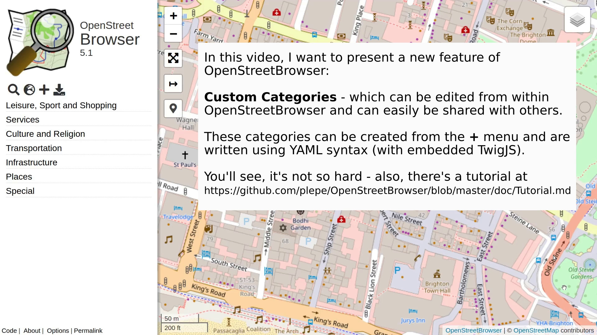

Categories can be created as YAML files. This is much simpler as JSON files, because you don't have to add all these quotes, you can use multi-line strings and allows adding comments.

A short tutorial is available as Youtube video:<br>
[](https://www.youtube.com/watch?v=I0x4Kwz6u90)

A simple example ([Source](https://www.openstreetbrowser.org/dev/OpenStreetBrowser/examples/src/branch/master/example1.yaml) | [Try this](https://www.openstreetbrowser.org/#categories=openstreetbrowser/examples/example1)). It queries nodes, ways and relations with amenity=restaurant from OpenStreetMap (via Overpass API), starting from zoom level 15. `nwr` is short for `(node[amenity=restaurant];way[amenity=restaurant];relation[amenity=restaurant];)`. Please note, that only a subset of OverpassQL is available (see [overpass-frontend](https://github.com/plepe/overpass-frontend) for details).

```yaml
# From zoom level 15 on, load all node, ways and relations with amenity=restaurant.
query:
  15: nwr[amenity=restaurant]
```

Another example, showing fountains from z15 and (additionally) drinking_water from z17. ([Source](https://www.openstreetbrowser.org/dev/OpenStreetBrowser/examples/src/branch/master/example2.yaml) | [Try this](https://www.openstreetbrowser.org/#categories=openstreetbrowser/examples/example2)):

This is the first examples which uses [TwigJS](https://github.com/twigjs/twig.js) for programming logic. TwigJS is a port of the [Twig template language](https://twig.symfony.com/doc/3.x/templates.html).

Here, we are using Unicode characters as icons. Alternatively, OpenStreetBrowser includes a [few icon sets](./Icons.md) which you can use.

```yaml
query:
  # query as single line string:
  15: nwr[amenity=fountain]
  # query as multi line string:
  17: |
    (
      nwr[amenity=fountain];
      nwr[amenity=drinking_water];
    )
feature:
  # In the description, '{{ ... }}' is a TwigJS template. In this case it will
  # translate either the tag 'amenity=fountain' or 'amenity=drinking_water'
  # into a localized string:
  description: |
    {{ tagTrans('amenity', tags.amenity) }}
  # ' is a code block in Twig, it can be used for setting variables,
  # if and for statements. This places different icons in the markers:
  markerSign: |
    
    ⛲
    
    🚰
    
```

Improving on the example above, we add a `const` block. The values of this block are available throughout the code ([Source](https://www.openstreetbrowser.org/dev/OpenStreetBrowser/examples/src/branch/master/example3.yaml) | [Try this](https://www.openstreetbrowser.org/#categories=openstreetbrowser/examples/example3)):
```yaml
# Adding a category name (in English: "Example 3")
name:
  en: Example 3
query:
  15: nwr[amenity=fountain]
  # This query uses a regular expression to match either fountain or drinking_water:
  17: nwr[amenity~"^(fountain|drinking_water)$"]
feature:
  description: |
    {{ tagTrans('amenity', tags.amenity) }}
  # Here, the correct icon for display is read from the 'const' structure
  markerSign: |
    {{ const[tags.amenity].icon }}
  # We can use different markers depending on the type of item
  markerSymbol: |
    {{ markerPointer({ fillColor: const[tags.amenity].color }) }}
  # This is for the marker in the listing in the sidebar
  listMarkerSymbol: |
    {{ markerCircle({ fillColor: const[tags.amenity].color }) }}
const:
  fountain:
    icon: ⛲
    color: '#0000ff' # need to quote, because YAML would treat the color as comment
  drinking_water:
    icon: 🚰
    color: '#007fff'
```

Improving on the example above, we add a `info` block to show a map key. ([Source](https://www.openstreetbrowser.org/dev/OpenStreetBrowser/examples/src/branch/master/example4.yaml) | [Try this](https://www.openstreetbrowser.org/#categories=openstreetbrowser/examples/example4)):
```yaml
query:
  15: nwr[amenity=fountain]
  17: nwr[amenity~"^(fountain|drinking_water)$"]
feature:
  description: |
    {{ tagTrans('amenity', tags.amenity) }}
  # Here, the correct icon for display is read from the 'const' structure
  markerSign: |
    {{ const[tags.amenity].icon }}
  markerSymbol: |
    {{ markerPointer({ fillColor: const[tags.amenity].color }) }}
  listMarkerSymbol: |
    {{ markerCircle({ fillColor: const[tags.amenity].color }) }}
info: |
  # We create a table which shows icon in the left column and description in the
  # right. Due to the 'if' statement in the for loop the map key changes due to
  # the current zoom level (`map.zoom`):
  <table>
  
    <tr>
      <td>{{ markerCircle({ fillColor: data.color }) }}<div class='sign'>{{ data.icon }}</div></td>
      <td>{{ tagTrans('amenity', value) }}</td>
    </tr>
  
  </table>
const:
  fountain:
    icon: ⛲
    color: '#0000ff'
    zoom: 15
  drinking_water:
    icon: 🚰
    color: '#007fff'
    zoom: 17
```

Back to the restaurants, we will display the cuisine(s) of the restaurants and even add a filter. In OpenStreetMap, cuisine is tag which can take several values, separated by `;`, e.g. `pizza;burger`. Detailed documentation about filters can be found [here](./Filter.md). ([Source](https://www.openstreetbrowser.org/dev/OpenStreetBrowser/examples/src/branch/master/example5.yaml) | [Try this](https://www.openstreetbrowser.org/#categories=openstreetbrowser/examples/example5)):
```yaml
name:
  en: Example 5
query:
  15: nwr[amenity=restaurant]
feature:
  description: |
    {{ tagTrans('amenity', tags.amenity) }}
  # Details are written to the right side of the popup / the box in the list.
  # tagTransList is a function, which splits the value by ';' and translates
  # each value individually. They are joined as enumeration.
  details: |
    {{ tagTransList('cuisine', tags.cuisine) }}
  # Body is shown in the popup and the details in the sidebar. An easy way to
  # show all tags is using the TwigJS 'yaml' filter, which produces YAML.
  # Alternatively, you could use 'json_pp' (JSON pretty print).
  body: |
    <pre>{{ tags|yaml }}</pre>
filter:
  cuisine:
    name: "{{ keyTrans('cuisine') }}"
    type: select
    key: cuisine
    op: has # query semicolon-separated lists
    values: |
      
      <option value='{{ value }}'>{{ tagTrans('cuisine', value) }}</option>
      
      <option value='-' query='nwr[!cuisine]' weight='1'>{{ trans('empty value') }}</option>
      <option value='*' query='nwr[cuisine]' weight='1'>Any value</option>
    # The option will be ordered by text content. Set 'weight' option to override order.
    # Also, the last two options set an explicit OverpassQL query.
const:
  cuisine: ["pizza", "burger", "kebab"]
```

Roads, with different color depending on its priority ([Source](https://www.openstreetbrowser.org/dev/OpenStreetBrowser/examples/src/branch/master/roads1.yaml) | [Try this](https://www.openstreetbrowser.org/#categories=openstreetbrowser/examples/roads1)):
```yaml
name: 
  en: Roads 1 # English name of the category
query:
  9: way[highway~"^(motorway|trunk)$"];
  11: way[highway~"^(motorway|trunk|primary)$"];
  13: way[highway~"^(motorway|trunk|primary|secondary|tertiary)$"];
  15: way[highway~"^(motorway|trunk|primary|secondary|tertiary|road|residential)$"];
feature:
  description: |
    {{ tagTrans('highway', tags.highway) }}
  markerSymbol: # empty, to hide the marker
  listMarkerSymbol: line # show a line which is generated from the style
  style:
    width: 4
    color: |
      #ff0000
      #ff3f00
      #ff7f00
      #ffff00
```

We rewrite the above example to use `const` for coloring. Also, we are adding a casing, to improve visibility of the roads on the map, and a label. ([Source](https://www.openstreetbrowser.org/dev/OpenStreetBrowser/examples/src/branch/master/roads2.yaml) | [Try this](https://www.openstreetbrowser.org/#categories=openstreetbrowser/examples/roads2)):
```yaml
name:
  en: Roads 2 # English name of the category
query:
  9: way[highway~"^(motorway|trunk)$"];
  11: way[highway~"^(motorway|trunk|primary)$"];
  13: way[highway~"^(motorway|trunk|primary|secondary|tertiary)$"];
  15: way[highway~"^(motorway|trunk|primary|secondary|tertiary|road|residential)$"];
feature:
  description: |
    {{ tagTrans('highway', tags.highway) }}
  markerSymbol: # empty, to hide the marker
  listMarkerSymbol: line # show a line which is generated from the style
  style:casing:
    width: 8
    color: '#000000'
    pane: casing # use the predefined 'casing' pane, so that this line is below the 'style'
  style:
    width: 4
    color: |
      {{ (const[tags.highway]|default(const.default)).color }}
    text: |
      {{ tags.name }}
    textOffset: -8
const:
  motorway:
    color: '#ff0000'
  trunk:
    color: '#ff3f00'
  primary:
    color: '#ff7f00'
  default:
    color: '#ffff00'
```

All scripts of a feature are processed in the order of their appearance. As they all use the same scope, Twig variables (set via ``) are available in all sub-sequent scripts.

For a full list of parameters, see [the category parameters](./CategoryParameters.md).
